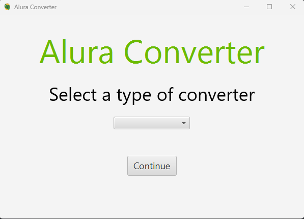
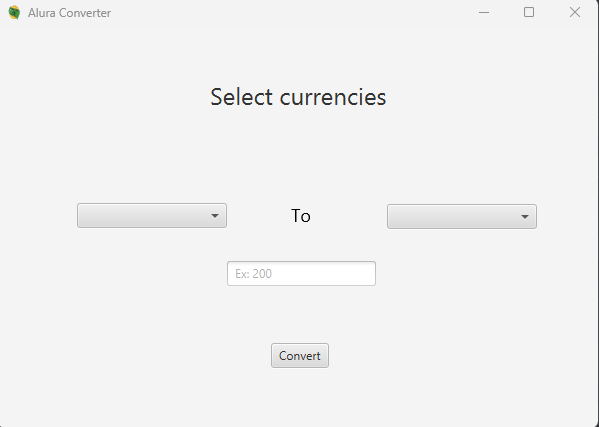
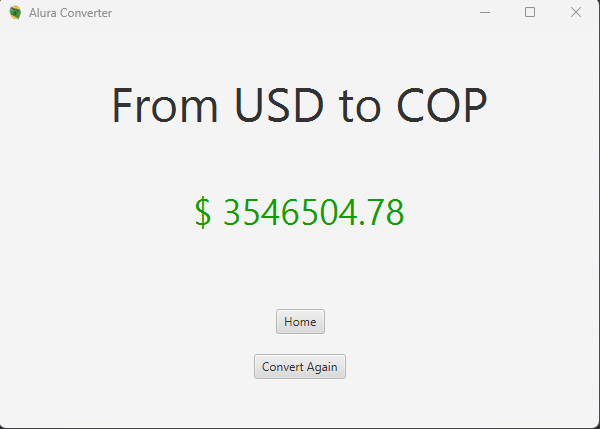
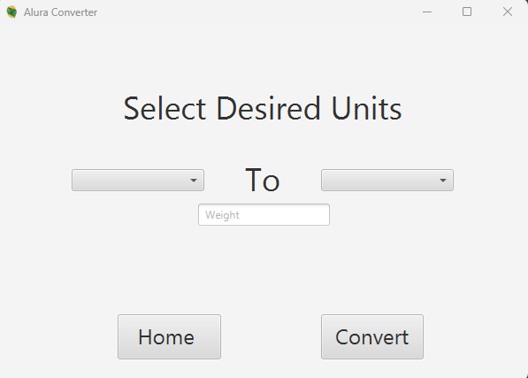
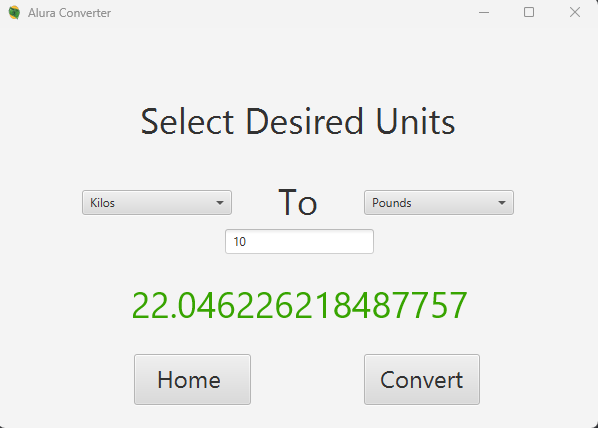

# CurrencyConverterAlura

Currency and unit converter for Alura's backend challenge.

### Dependencies

- JavaFX
- Gson

### About the implementation

- *Currency Converter:* User input is validated before sending it to an API that converts the received inputs.

- *Unit converter:* User input is validated and input is converted using a formula inside the code.

## Views

### Home

### Currency Converter

 

### Weight Converter

 

### Input Validation

Messages will be displayed under TextInput fields when required.